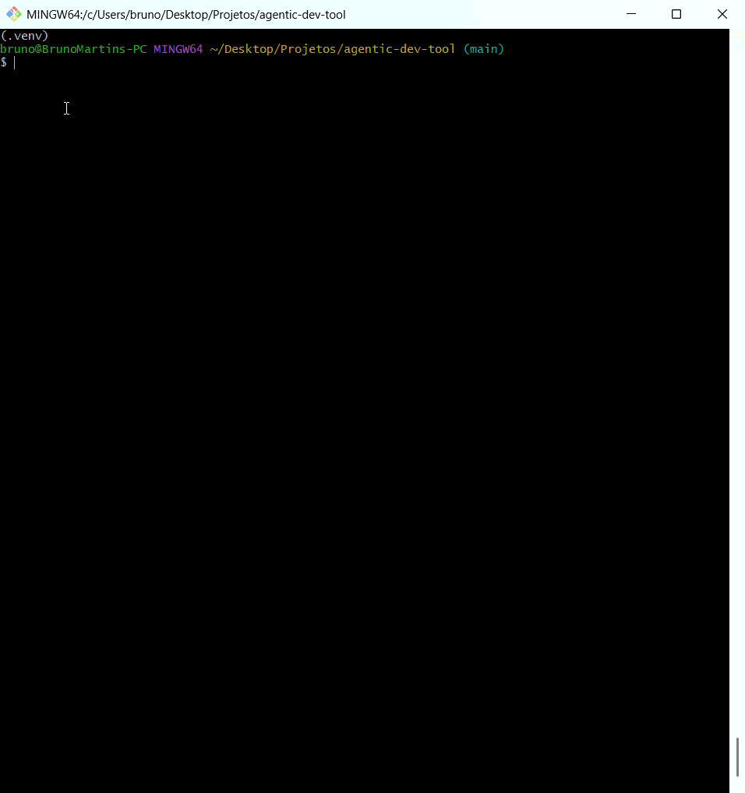
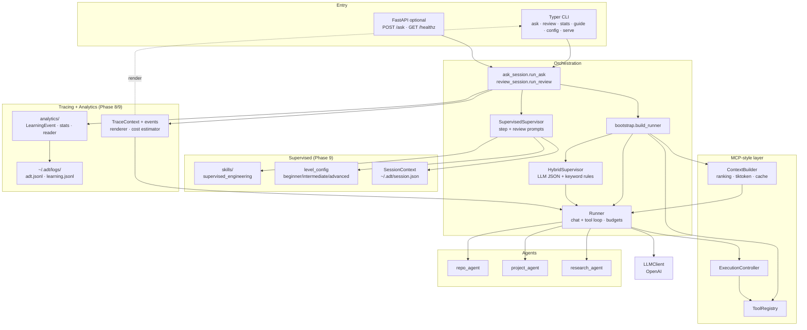

# Agentic Dev Tool (`adt`)

[](https://github.com/brunoramosmartins/agentic-dev-tool/actions/workflows/ci.yml)
[](https://pypi.org/project/agentic-dev-tool/)
[](https://www.python.org/downloads/)
[](https://opensource.org/licenses/MIT)
[](https://brunoramosmartins.github.io/agentic-dev-tool)

**Portfolio-grade CLI** (and optional **HTTP API**) that routes natural-language questions to **specialized agents**—repository analysis, GitHub project context, and technical research—backed by **OpenAI tool calling** and an **MCP-style** in-process layer: tool **registry**, **JSON Schema** validation, **tiktoken** budgets, ranked context, and disk cache. Ships with a **supervised learning mode** (step-by-step teaching with difficulty levels), **code review**, **request tracing** with cost estimates, and **learning analytics**.

## Demo

<p align="center">
  
</p>

---

## Contents

- [Why this project](#why-this-project)
- [Features](#features)
- [Architecture](#architecture)
- [Quick start](#quick-start)
- [Installation](#installation)
- [Setup checklist (keys, env, secrets)](#setup-checklist-keys-env-secrets)
- [Configuration](#configuration)
- [Usage](#usage)
- [HTTP API (optional)](#http-api-optional)
- [Commands](#commands)
- [File layout and state](#file-layout-and-state)
- [Skills](#skills)
- [Development](#development)
- [Releasing (maintainers: PyPI + GitHub)](#releasing-maintainers-pypi--github)
- [Portfolio checklist](#portfolio-checklist)
- [Documentation](#documentation)
- [License](#license)

---

## Why this project

This repo demonstrates **agentic architecture** without a toy script: a real **Typer** CLI, **Pydantic** schemas, **hybrid routing** (LLM JSON classification + keyword fallback), **multi-repo** sessions, **CI** (Ruff, mypy, pytest, package smoke install), and an **optional FastAPI** surface. It maps to a full **phase roadmap** ([`ROADMAP.md`](ROADMAP.md)) from bootstrap through **v1.0.0** on PyPI.

---

## Features

| Area | What you get |
|------|----------------|
| **Agents** | `repo_agent`, `project_agent`, `research_agent` with tool loops |
| **Routing** | `HybridSupervisor`: cheap LLM JSON intent + keyword-rule fallback |
| **Repos** | Multi `--repo`, `compare_repos`, tree cache, ranked files |
| **GitHub** | Issues/milestones via API; optional PAT for rate limits |
| **Research** | arXiv + HTTP fetch tools |
| **Supervised mode** | Step-by-step teaching guided by the `supervised_engineering` skill |
| **Difficulty levels** | `beginner`, `intermediate`, `advanced` reshape hints, granularity, and tone |
| **Code review** | `adt review <file>` → structured feedback (issues, strengths, next step, verdict) |
| **Learning analytics** | Rotating `~/.adt/logs/learning.jsonl` + `adt stats` panel with trends, verdicts, common issues, tokens |
| **Tracing** | `--trace` shows routing → context build → LLM/tool calls with token + USD estimates |
| **Config** | `~/.adt/config.toml` + `adt config show/set/path` + `ADT_*` env overrides |
| **Guide** | `adt guide` prints a static cheat sheet (no API key needed) |
| **API** | `adt serve` — FastAPI `/healthz`, `/ask` ([`[api]`](https://pypi.org/project/agentic-dev-tool/) extra) |

---

## Architecture

High-level data flow from terminal or HTTP into one shared pipeline (`adt.ask_session.run_ask`), then the runner, tools, and model. Shaded subsystems (Supervised, Tracing, Analytics) are Phase 8/9 additions that wrap the base agent loop.



**Narrative:** the user’s query and repo hints become a `QueryRequest`; the hybrid supervisor picks an agent; `ContextBuilder` packs bounded context; the `Runner` chats with the model, executes **tool calls** through the registry/executor, and returns an `AgentResponse` (answer, tools used, routing metadata). In **supervised mode**, `SupervisedSupervisor` overrides the prompt using the packaged `supervised_engineering` skill plus level directives and persists a lightweight `SessionContext` between runs. The **review** flow reuses the same skill to produce structured feedback (`ReviewFeedback`). **Tracing** captures per-iteration events (routing, context build, LLM/tool calls) plus token + USD estimates. **Analytics** writes supervised and review outcomes to a rotating JSONL log that `adt stats` aggregates. The CLI renders **Rich** panels; the API returns JSON.

Deeper design notes: [`docs/architecture.md`](docs/architecture.md) · tool contracts: [`docs/mcp.md`](docs/mcp.md) · agents/prompts: [`docs/agents.md`](docs/agents.md).

---

## Quick start

```bash
pip install agentic-dev-tool
export OPENAI_API_KEY="sk-..."   # Windows PowerShell: $env:OPENAI_API_KEY="sk-..."
adt ask "What does this codebase do?" --repo .
```

Optional GitHub-backed questions (better with a token):

```bash
export GITHUB_TOKEN="ghp_..."    # fine-grained or classic PAT with repo read
adt ask "Summarize open issues" --repo owner/repo
```

---

## Installation

Requires **Python 3.10+**.

### From PyPI

```bash
pip install agentic-dev-tool
adt version
```

Optional HTTP API:

```bash
pip install "agentic-dev-tool[api]"
adt serve --port 8765
# Docs: http://127.0.0.1:8765/docs
```

### From source (contributors)

```bash
python -m venv .venv
source .venv/bin/activate          # Windows: .venv\Scripts\activate
pip install -e ".[dev]"
pre-commit install                 # optional
```

With Make (Unix-like):

```bash
make install
```

---

## Setup checklist (keys, env, secrets)

Use this when polishing the project for **local use**, **CI**, and **publishing**.

### 1. OpenAI API key (required for `adt ask` and `adt serve`)

1. Create a key in the [OpenAI API platform](https://platform.openai.com/api-keys) (billing enabled as per your account).
2. **Never commit keys.** Keep them out of git; `.env` is gitignored if you copy from [`.env.example`](.env.example).
3. **Expose the key to the shell** before running `adt`:
   - **macOS / Linux:** `export OPENAI_API_KEY="sk-..."`
   - **Windows CMD:** `set OPENAI_API_KEY=sk-...`
   - **Windows PowerShell:** `$env:OPENAI_API_KEY="sk-..."`
4. **Optional:** put `OPENAI_API_KEY=...` in `.env` and load it with [direnv](https://direnv.net/), your IDE’s env loader, or manual `source`—the CLI does not auto-read `.env`; the process must see the variable.
5. **GitHub Actions CI** in this repo **does not** use `OPENAI_API_KEY` (tests mock the API). You **do not** add this secret to GitHub for the default CI workflow.

### 2. GitHub token (optional, for `project_agent`)

1. Create a [Personal Access Token](https://github.com/settings/tokens) with read access to the repos you query (classic `repo` scope for private repos, or fine-grained “Contents/Issues read” as appropriate).
2. Set `GITHUB_TOKEN` in the environment, or pass `--token` once on the CLI.
3. Without a token, anonymous GitHub API limits apply (~60 requests/hour per IP).

### 3. Persistent CLI settings

1. Run `adt config show` — creates/uses **`~/.adt/config.toml`**.
2. Override file defaults with `ADT_*` variables (see table below) when useful for CI or shells.

### 4. Publishing to PyPI from GitHub (maintainers only)

The workflow [`.github/workflows/release.yml`](.github/workflows/release.yml) runs on tags `v*`.

Pick **one** authentication method:

| Method | What you do |
|--------|-------------|
| **Trusted publishing (recommended)** | In [pypi.org](https://pypi.org) → your project → **Publishing** → add a **trusted publisher** pointing at this GitHub repo and the `Release` workflow. The workflow already sets `id-token: write` for OIDC. Leave `PYPI_API_TOKEN` unset. |
| **API token** | On PyPI, create an API token. In GitHub: **Settings → Secrets and variables → Actions → New repository secret** → name **`PYPI_API_TOKEN`**, value = the token. The publish action uses it as the password. |

After the first successful publish, verify: `pip install agentic-dev-tool` and `adt version`.

### 5. Tag and GitHub Release

1. Merge release work to `main` with `version = "1.0.0"` (or next semver) in [`pyproject.toml`](pyproject.toml) and an entry in [`CHANGELOG.md`](CHANGELOG.md).
2. Create an annotated tag: `git tag -a v1.0.0 -m "Release v1.0.0"` then `git push origin v1.0.0`.
3. The **Release** workflow builds wheels, publishes to PyPI, and creates a GitHub Release (with generated release notes). You may edit the release description to paste the CHANGELOG section.

---

## Configuration

Copy the template and fill values locally (do not commit `.env`):

```bash
cp .env.example .env
```

| Variable | Required | Description |
|----------|----------|-------------|
| `OPENAI_API_KEY` | Yes, for `ask` / `serve` | OpenAI API key. |
| `GITHUB_TOKEN` | No | PAT for `read_issues` / `read_milestones`. |
| `ADT_LIVE_MODEL` | No | Model for `pytest -m live` (default `gpt-4o-mini`). |
| `ADT_TOKEN_BUDGET` | No | Logical token window per ask (default `16384`). |
| `ADT_CACHE_TTL` | No | Tree cache TTL in seconds (default `300`). |
| `ADT_DEFAULT_MODEL` | No | Overrides `[adt] default_model` in config. |
| `ADT_LOG_LEVEL` | No | Overrides config log level for file logging. |
| `ADT_USE_LLM_ROUTING` | No | `0` / `1` — LLM intent routing. |
| `ADT_ROUTING_MODEL` | No | Model for routing JSON call. |
| `ADT_MAX_TOOL_ITERATIONS` | No | Max LLM/tool rounds per agent step. |

`adt config show` / `adt config set` manage **`~/.adt/config.toml`**. CLI flags and `ADT_*` override file defaults where documented in code.

**Related CLI flags (Phase 8/9 additions):**

- `--mode {execution,supervised}` and `--level {beginner,intermediate,advanced}` on `adt ask` switch the pipeline to the supervised supervisor.
- `--trace` on `adt ask` prints a Rich trace panel (routing, context, LLM calls, cost).
- `adt review <file>` accepts `--level` and `--context` to tune reviewer tone and scope.
- `adt stats --last N` limits aggregation to the most recent N supervised sessions.

---

## Usage

### Local repository

```bash
adt ask "What does this project do?" --repo .
```

### Multi-repository

```bash
adt ask "Compare dependency files in these two trees" --repo ./my-fork --repo ../upstream
```

Checkouts get session ids (`r0`, `r1`, …). Use **`compare_repos`** for a structured diff.

### GitHub project (`owner/repo`)

If `--repo` is a slug like `octocat/Hello-World` and that path is not a local folder, the **current working directory** is the markdown root for `read_markdown`, and the slug sets the default GitHub target:

```bash
cd ~/my-clone
adt ask "Summarize open issues" --repo octocat/Hello-World
adt ask "What milestones are open?" --repo myorg/my-repo --token ghp_xxx
```

### Research

```bash
adt ask "Recent papers on retrieval augmented generation" --repo .
```

### Force an agent

```bash
adt ask "Explain src layout" --repo . --agent repo_agent
adt ask "List issues" --repo myorg/repo --agent project_agent
```

### Supervised mode (learning)

Instead of solving the task, `adt` acts as a tutor — it plans 3–6 steps, reveals
them one at a time, and asks checkpoint questions. The `supervised_engineering`
skill (packaged under `src/adt/skills/`) drives the teaching heuristics and the
review rubric.

```bash
adt ask "Implement binary search in Python" \
  --mode supervised --level beginner --repo .
```

Difficulty levels reshape the response:

| Level | Effect |
|-------|--------|
| `beginner` | Smaller steps, more hints, explicit type guidance, encouraging tone. |
| `intermediate` | Balanced granularity and hinting (default). |
| `advanced` | Larger steps, trade-off discussion, minimal hand-holding, critical tone. |

Session state (current step, previous feedback) is persisted at
`~/.adt/session.json` so the next `ask`/`review` picks up where you left off.

### Code review

Submit a file and get structured feedback (issues with line numbers, strengths,
next step, overall verdict) from the reviewer LLM. Feedback is rendered as a
colored Rich panel and the verdict feeds back into the session + analytics log.

```bash
adt review src/mymod/solution.py --context "binary search exercise"
adt review src/mymod/solution.py --level advanced
```

### Tracing (`--trace`)

Adds a trace panel under the answer showing routing decision, context build
stats, per-iteration LLM/tool calls, cumulative tokens, and a USD cost
estimate via `adt.tracing.cost`.

```bash
adt ask "Explain this repo" --repo . --trace
```

### Learning analytics (`adt stats`)

Supervised runs and reviews append `LearningEvent`s to a rotating
`~/.adt/logs/learning.jsonl`. `adt stats` renders a panel with session count,
review verdicts, common issue categories, improvement trend, and token totals.

```bash
adt stats           # full history
adt stats --last 10 # only the last 10 supervised sessions
```

### Quick reference (`adt guide`)

`adt guide` prints a static cheat sheet (commands, modes, levels, agents,
skills, environment) without making any API calls — ideal when you just
installed the tool or want to jog your memory.

```bash
adt guide
```

### Common flags

- `--repo`, `-r` — Repeatable: existing directory or `owner/repo` slug.
- `--token` — GitHub PAT for this run (overrides `GITHUB_TOKEN`).
- `--agent`, `-a` — `repo_agent`, `research_agent`, or `project_agent`.
- `--mode` — `execution` (default) or `supervised`.
- `--level` — `beginner`, `intermediate`, `advanced` (supervised only).
- `--trace` — Print a trace panel with routing, LLM calls, token use, and cost.
- `--verbose`, `-v` — Debug logging, token usage, budget hint, context snippet.
- `--log-level` — `DEBUG` … `ERROR` for JSON file logs under `~/.adt/logs/`.
- `--no-cache` — Skip repo tree cache.
- `--model`, `-m` — Model override (default from config or `gpt-4o-mini`).

---

## HTTP API (optional)

Install `[api]`, then:

```bash
adt serve --host 127.0.0.1 --port 8765
```

| Endpoint | Purpose |
|----------|---------|
| `GET /healthz` | Liveness JSON (`status`, `version`). |
| `POST /ask` | Body: `query`, optional `repo` (list), `github_token`, `agent`, `no_cache`, `model`. Same pipeline as CLI; **`OPENAI_API_KEY` must be set in the server environment**. |

---

## Commands

| Command | Purpose |
|---------|---------|
| `adt ask …` | Main agent loop (supports `--mode supervised`, `--level`, `--trace`). |
| `adt review <file>` | Structured code review with issues, strengths, next step, verdict. |
| `adt stats [--last N]` | Aggregate supervised learning log: sessions, verdicts, trend, tokens. |
| `adt guide` | Static quick-reference: commands, modes, levels, agents, skills. |
| `adt serve` | FastAPI + uvicorn (`[api]`). |
| `adt config show` / `path` / `set` | `~/.adt/config.toml`. |
| `adt version` | Package version. |
| `adt info` | Short feature summary. |

```bash
adt --help && adt ask --help && adt review --help && adt stats --help
```

> **Tip:** `adt guide` does not require `OPENAI_API_KEY` and never hits the
> network — it is the fastest way to see every feature at a glance.

---

## File layout and state

`adt` keeps all mutable state under `~/.adt/` so your repositories stay clean:

| Path | Written by | Purpose |
|------|------------|---------|
| `~/.adt/config.toml` | `adt config set` | Persistent defaults (model, log level, routing). |
| `~/.adt/cache/` | `ContextBuilder` | Repo tree cache (`--no-cache` or `ADT_CACHE_TTL=0` to disable). |
| `~/.adt/logs/adt.jsonl` | `log_adt` helper | Structured runtime logs (routing, tool calls, errors). |
| `~/.adt/logs/learning.jsonl` | `adt ask --mode supervised`, `adt review` | Rotating JSONL (10 MB × 5 backups) consumed by `adt stats`. |
| `~/.adt/session.json` | `adt ask --mode supervised`, `adt review` | Current supervised step, iteration count, recent feedback. |

Delete any of these to reset the corresponding state — nothing under `~/.adt`
is required for a fresh install.

---

## Skills

Supervised teaching heuristics live in a **packaged skill** so they can be
edited and versioned without touching agent code.

```
src/adt/skills/
└── supervised_engineering/
    ├── SKILL.md        # When/when-not/how (teaching heuristics + rubric)
    ├── loader.py       # load_skill_content() via importlib.resources
    └── __init__.py
```

`SupervisedSupervisor` reads the markdown via `importlib.resources` at runtime
and prepends it to both the step-guidance and code-review prompts. Level
directives (`beginner`/`intermediate`/`advanced`) come from
`adt.core.level_config.LEVEL_CONFIGS` and are concatenated after the skill so
prompt tone, hint count, and step granularity all change with `--level`.

To add a new skill:

1. Create `src/adt/skills/<name>/SKILL.md` and a matching `loader.py`.
2. Register the skill path in the package wheel (`pyproject.toml` already
   includes `src/adt/skills/**/*.md`).
3. Load it from the agent/supervisor that consumes it.

---

## Development

```bash
make lint       # ruff check
make format     # ruff format
make test       # pytest + coverage (excludes @pytest.mark.live)
make typecheck  # mypy src/
python -m build # sdist + wheel → dist/  (needs: pip install build)
```

Live model tests (manual / optional CI job you add yourself):

```bash
export OPENAI_API_KEY="sk-..."
pytest -m live
```

---

## Releasing (maintainers: PyPI + GitHub)

1. Bump **`pyproject.toml`** version and **`CHANGELOG.md`**.
2. Merge to **`main`**.
3. Tag **`vX.Y.Z`** and push the tag → **`Release`** workflow ([`release.yml`](.github/workflows/release.yml)).
4. Configure PyPI **trusted publisher** or **`PYPI_API_TOKEN`** (see [Setup checklist §4](#4-publishing-to-pypi-from-github-maintainers-only)).

Full contributor notes: [`docs/contributing.md`](docs/contributing.md).

---

## Portfolio checklist

Aligned with **Phase 7** / [`docs/portfolio.md`](docs/portfolio.md):

- [x] Record a **terminal demo** and embed in README (`docs/assets/demo.gif`).
- [x] **Embed** the demo GIF at the top of the README.
- [ ] Add a **one-paragraph** project card on your personal site with links to GitHub, PyPI, and `docs/architecture.md`.
- [ ] Optional: short **article** (blog/LinkedIn)—problem, architecture, trade-offs.
- [ ] Close or archive **GitHub milestones/issues** when you consider the roadmap complete.

---

## Documentation

| Doc | Topic |
|-----|--------|
| [`ROADMAP.md`](ROADMAP.md) | Phases, milestones, conventions |
| [`docs/architecture.md`](docs/architecture.md) | Design decisions, module map |
| [`docs/mcp.md`](docs/mcp.md) | Tool registry, context, execution |
| [`docs/agents.md`](docs/agents.md) | Agents and prompts |
| [`docs/contributing.md`](docs/contributing.md) | PRs, packaging, PyPI |
| [`CHANGELOG.md`](CHANGELOG.md) | Release history |

---

## License

MIT — see [`LICENSE`](LICENSE).
